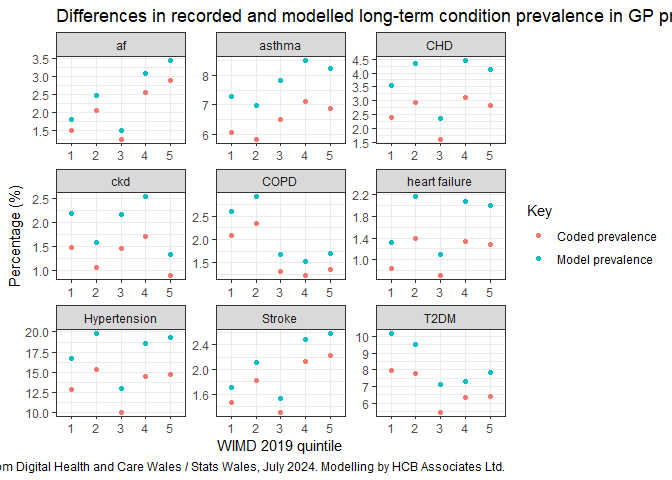
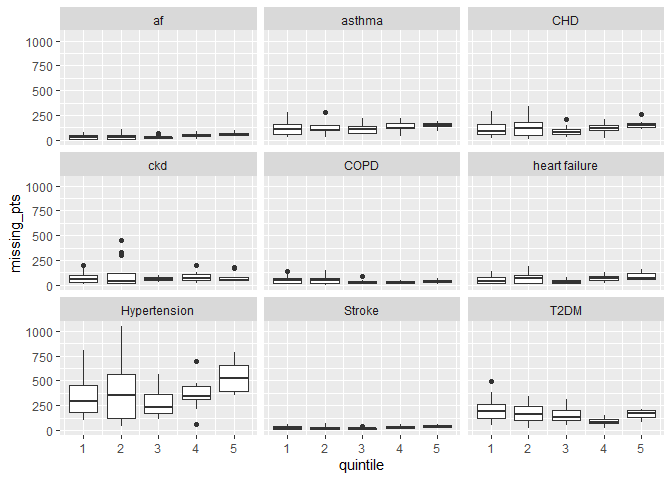
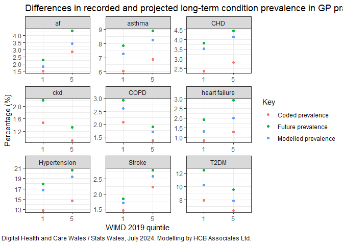
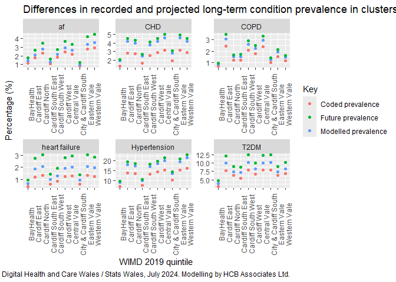

LTC data in Cardiff and Vale
================
Jonny Currie
2025-09-09

## R Markdown

This page summarises an analysis of data on long-term condition
prevalence and modelling for the Cardiff and Vale area.

``` r
#Load Packages

pks <- c("tidyverse", "purrr", "tibble", 
         "lubridate", "readODS", "janitor", "patchwork")

sapply(pks, library, character.only = T)
```

    ## Warning: package 'tidyverse' was built under R version 4.3.3

    ## Warning: package 'tibble' was built under R version 4.3.3

    ## Warning: package 'tidyr' was built under R version 4.3.3

    ## Warning: package 'readr' was built under R version 4.3.3

    ## Warning: package 'purrr' was built under R version 4.3.3

    ## Warning: package 'dplyr' was built under R version 4.3.3

    ## Warning: package 'stringr' was built under R version 4.3.3

    ## Warning: package 'forcats' was built under R version 4.3.3

    ## Warning: package 'lubridate' was built under R version 4.3.3

    ## ── Attaching core tidyverse packages ──────────────────────── tidyverse 2.0.0 ──
    ## ✔ dplyr     1.1.4     ✔ readr     2.1.5
    ## ✔ forcats   1.0.0     ✔ stringr   1.5.1
    ## ✔ ggplot2   3.5.2     ✔ tibble    3.2.1
    ## ✔ lubridate 1.9.4     ✔ tidyr     1.3.1
    ## ✔ purrr     1.0.4     
    ## ── Conflicts ────────────────────────────────────────── tidyverse_conflicts() ──
    ## ✖ dplyr::filter() masks stats::filter()
    ## ✖ dplyr::lag()    masks stats::lag()
    ## ℹ Use the conflicted package (<http://conflicted.r-lib.org/>) to force all conflicts to become errors

    ## Warning: package 'readODS' was built under R version 4.3.3

    ## Warning: package 'janitor' was built under R version 4.3.3

    ## 
    ## Attaching package: 'janitor'
    ## 
    ## The following objects are masked from 'package:stats':
    ## 
    ##     chisq.test, fisher.test

    ## $tidyverse
    ##  [1] "lubridate" "forcats"   "stringr"   "dplyr"     "purrr"     "readr"    
    ##  [7] "tidyr"     "tibble"    "ggplot2"   "tidyverse" "stats"     "graphics" 
    ## [13] "grDevices" "utils"     "datasets"  "methods"   "base"     
    ## 
    ## $purrr
    ##  [1] "lubridate" "forcats"   "stringr"   "dplyr"     "purrr"     "readr"    
    ##  [7] "tidyr"     "tibble"    "ggplot2"   "tidyverse" "stats"     "graphics" 
    ## [13] "grDevices" "utils"     "datasets"  "methods"   "base"     
    ## 
    ## $tibble
    ##  [1] "lubridate" "forcats"   "stringr"   "dplyr"     "purrr"     "readr"    
    ##  [7] "tidyr"     "tibble"    "ggplot2"   "tidyverse" "stats"     "graphics" 
    ## [13] "grDevices" "utils"     "datasets"  "methods"   "base"     
    ## 
    ## $lubridate
    ##  [1] "lubridate" "forcats"   "stringr"   "dplyr"     "purrr"     "readr"    
    ##  [7] "tidyr"     "tibble"    "ggplot2"   "tidyverse" "stats"     "graphics" 
    ## [13] "grDevices" "utils"     "datasets"  "methods"   "base"     
    ## 
    ## $readODS
    ##  [1] "readODS"   "lubridate" "forcats"   "stringr"   "dplyr"     "purrr"    
    ##  [7] "readr"     "tidyr"     "tibble"    "ggplot2"   "tidyverse" "stats"    
    ## [13] "graphics"  "grDevices" "utils"     "datasets"  "methods"   "base"     
    ## 
    ## $janitor
    ##  [1] "janitor"   "readODS"   "lubridate" "forcats"   "stringr"   "dplyr"    
    ##  [7] "purrr"     "readr"     "tidyr"     "tibble"    "ggplot2"   "tidyverse"
    ## [13] "stats"     "graphics"  "grDevices" "utils"     "datasets"  "methods"  
    ## [19] "base"     
    ## 
    ## $patchwork
    ##  [1] "patchwork" "janitor"   "readODS"   "lubridate" "forcats"   "stringr"  
    ##  [7] "dplyr"     "purrr"     "readr"     "tidyr"     "tibble"    "ggplot2"  
    ## [13] "tidyverse" "stats"     "graphics"  "grDevices" "utils"     "datasets" 
    ## [19] "methods"   "base"

``` r
#Load data

#Prevalence of LTCs by cluster in Wales, from https://statswales.gov.wales/Catalogue/Health-and-Social-Care/NHS-Primary-and-Community-Activity/GMS-Contract/diseaseregisters-by-localhealthboard-cluster-gppractice, Year ending 1st April 2024

ltc_prev <- read.csv("LTC_prev_cluster.csv") %>%
  mutate(practice = str_trim(practice))

#Convert into long format

ltc_long <- ltc_prev %>% drop_na() %>%
  pivot_longer(cols = -c("lhb", "cluster", "practice", "practice_code"), 
               names_to = "ltc", 
               values_to = "prevalence") %>%
  mutate(prevalence = as.numeric(prevalence))
```

    ## Warning: There was 1 warning in `mutate()`.
    ## ℹ In argument: `prevalence = as.numeric(prevalence)`.
    ## Caused by warning:
    ## ! NAs introduced by coercion

``` r
#CKD data is not published at all-Wales level from GP practice registers, but is available locally in Cardiff and Vale (2024/25 data)

#Load CKD data

ckd_df <- read.csv("ckd_data.csv") %>%
  select(-Measure) %>%
  filter(Organisation.Type %in% c("Practice")) %>%
  select(-Organisation.Type) %>%
  rename(practice=Organisation, year=Financial.Year, 
         prevalence=Percentage, lhb=Health.Board) %>%
  select(practice, prevalence) %>%
  add_column(lhb = "", cluster = "", practice_code = "", 
             ltc = "ckd")

#Merge with LTC data, note this is now a Cardiff and Vale only dataset

ltc_long_cav <- ltc_long %>%
  filter(lhb == "Cardiff and Vale University Health Board ")

ltc_long_ckd <- bind_rows(ltc_long_cav, ckd_df)

#GP practice deprivation data, from https://statswales.gov.wales/Catalogue/Health-and-Social-Care/General-Medical-Services/General-practice-population/deprivation-at-gppracticelevel, April 2024

prac_dep <- read.csv("practice_deprivation.csv") %>%
  mutate(practice = str_trim(practice))

#Estimated proportions of underdiagnosis of LTCs, from modelling done by Anosova and colleagues (2025), see https://journals.plos.org/plosone/article?id=10.1371/journal.pone.0313877, broken down by deprivation quintile

modelling <- read.csv("results_national_qimd.csv")

#These proportions estimate the levels of estimated underdiagnosis of various LTCs in England in 2008 and in 2018. However they do not include other conditions managed in primary care as such asthma, atrial fibrillation, heart failure and CKD

#A study published in 2018 by Aaron and colleagues (https://pubmed.ncbi.nlm.nih.gov/29756989) suggested around 20% of asthma is underdiagnosed, though there appears little research available to break this down to explore variation across socioeconomic groups

#Work from Wahab and colleagues (2025) suggests around 30% of AF is underdiagnosed, again while it is recognised levels of AF may be higher in areas of deprivation (https://commonslibrary.parliament.uk/health-inequalities-income-deprivation-and-north-south-divides), this is partly already recognised in NHS data and there is limited research on the levels of undiagnosis by deprivation group

#The ECHOES study, one of the largest community heart failure screening studies in the world, found a prevalence of 2.3% of heart failure in the general population (https://bmjopen.bmj.com/content/4/7/e005256). 

#Wales recorded a prevalence of heart failure in 2023/24 of 1.3% (https://phw.nhs.wales/services-and-teams/observatory/data-and-analysis/cardiovascular-disease-prevalence-trends-risk-factors-and-10-year-projections)

#This would make the estimated level of undiagnosis, irrespective of deprivation of 0.56 (1.3/2.3)

#Finally for CKD, a study of NHS data in 2022 by Carpio and colleagues (https://link.springer.com/article/10.1007/s40620-021-01149-0) suggested 48% of patients were undiagnosed

#Generate additional data with estimates of underdiagnosis for these LTCs

add_ltcs <- tibble(
  disease = rep("af", 5),
  year = rep(2018, 5),
  imd5 = c("Q1 Least Deprived", "Q2", "Q3", "Q4", "Q5 Most Deprived"),
  underdiagnosis = rep(0.20, 5)) %>%
add_row(
    disease = rep("heart failure", 5),
    year = rep(2018, 5),
    imd5 = c("Q1 Least Deprived", "Q2", "Q3", "Q4", "Q5 Most Deprived"),
    underdiagnosis = rep(0.56, 5)) %>%
  add_row(
  disease = rep("asthma", 5),
year = rep(2018, 5),
imd5 = c("Q1 Least Deprived", "Q2", "Q3", "Q4", "Q5 Most Deprived"),
underdiagnosis = rep(0.20, 5)) %>%
  add_row(
    disease = rep("ckd", 5),
    year = rep(2018, 5),
    imd5 = c("Q1 Least Deprived", "Q2", "Q3", "Q4", "Q5 Most Deprived"),
    underdiagnosis = rep(0.48, 5))

#Merge this with previous modelling data

modelling_v2 <- bind_rows(modelling, add_ltcs)

#Join prevalence and practice deprivation data

ltc_df <- ltc_long_ckd %>%
  select(practice, ltc, prevalence)

prac_dep_cav <- prac_dep %>%
  filter(lhb == "Cardiff and Vale University Health Board ") %>%
  mutate(practice = str_trim(practice))

ltc_dep <- left_join(prac_dep_cav, ltc_df, by = c("practice"))

#lot of rows with blank practice data, remove

ltc_dep <- ltc_dep %>%
  filter(practice != "")

#Need to re-add cluster data, create cluster lookup from original LTC prevalence dataset

prac_cluster_lookup <- read.csv("LTC_prev_cluster.csv") %>%
  mutate(practice = str_trim(practice)) %>%
  select(practice, cluster) %>%
  unique()

ltc_dep <- left_join(ltc_dep, prac_cluster_lookup, by = "practice", 
          relationship = "many-to-many")

head(ltc_dep)
```

    ##                                         lhb                 practice
    ## 1 Cardiff and Vale University Health Board  West Quay Medical Centre
    ## 2 Cardiff and Vale University Health Board  West Quay Medical Centre
    ## 3 Cardiff and Vale University Health Board  West Quay Medical Centre
    ## 4 Cardiff and Vale University Health Board  West Quay Medical Centre
    ## 5 Cardiff and Vale University Health Board  West Quay Medical Centre
    ## 6 Cardiff and Vale University Health Board  West Quay Medical Centre
    ##   practice_code patients no_depriv perc_depriv quintile
    ## 1       W97001     14502      1834   12.646532        3
    ## 2       W97001     14502      1834   12.646532        3
    ## 3       W97001     14502      1834   12.646532        3
    ## 4       W97001     14502      1834   12.646532        3
    ## 5       W97001     14502      1834   12.646532        3
    ## 6       W97001     14502      1834   12.646532        3
    ##                                              ltc prevalence       cluster
    ## 1                                         Asthma   7.705562 Central Vale 
    ## 2                            Atrial.fibrillation   2.329589 Central Vale 
    ## 3                                         Cancer   2.557034 Central Vale 
    ## 4          Chronic.obstructive.pulmonary.disease   2.150389 Central Vale 
    ## 5 Secondary.prevention.of.coronary.heart.disease   3.053277 Central Vale 
    ## 6                                       Dementia   0.537597 Central Vale

``` r
modelling
```

    ##                disease year              imd5 underdiagnosis
    ## 1   Anxiety/Depression 2008 Q1 Least Deprived      0.3642058
    ## 2   Anxiety/Depression 2008                Q2      0.4460937
    ## 3   Anxiety/Depression 2008                Q3      0.3700298
    ## 4   Anxiety/Depression 2008                Q4      0.4452510
    ## 5   Anxiety/Depression 2008  Q5 Most Deprived      0.3473597
    ## 6   Anxiety/Depression 2018 Q1 Least Deprived      0.4076460
    ## 7   Anxiety/Depression 2018                Q2      0.3223417
    ## 8   Anxiety/Depression 2018                Q3      0.3148667
    ## 9   Anxiety/Depression 2018                Q4      0.1644001
    ## 10  Anxiety/Depression 2018  Q5 Most Deprived      0.2293193
    ## 11       Breast cancer 2008 Q1 Least Deprived      0.6266433
    ## 12       Breast cancer 2008                Q2      0.5961298
    ## 13       Breast cancer 2008                Q3      0.6329823
    ## 14       Breast cancer 2008                Q4      0.6143283
    ## 15       Breast cancer 2008  Q5 Most Deprived      0.5638266
    ## 16       Breast cancer 2018 Q1 Least Deprived      0.6646934
    ## 17       Breast cancer 2018                Q2      0.6422542
    ## 18       Breast cancer 2018                Q3      0.6577029
    ## 19       Breast cancer 2018                Q4      0.6434677
    ## 20       Breast cancer 2018  Q5 Most Deprived      0.5884609
    ## 21                 CHD 2008 Q1 Least Deprived      0.5331348
    ## 22                 CHD 2008                Q2      0.5028504
    ## 23                 CHD 2008                Q3      0.5181730
    ## 24                 CHD 2008                Q4      0.5165331
    ## 25                 CHD 2008  Q5 Most Deprived      0.5140624
    ## 26                 CHD 2018 Q1 Least Deprived      0.4667304
    ## 27                 CHD 2018                Q2      0.4365020
    ## 28                 CHD 2018                Q3      0.4707976
    ## 29                 CHD 2018                Q4      0.4749461
    ## 30                 CHD 2018  Q5 Most Deprived      0.4839107
    ## 31                COPD 2008 Q1 Least Deprived      0.4126726
    ## 32                COPD 2008                Q2      0.4112624
    ## 33                COPD 2008                Q3      0.4180196
    ## 34                COPD 2008                Q4      0.3811644
    ## 35                COPD 2008  Q5 Most Deprived      0.3758908
    ## 36                COPD 2018 Q1 Least Deprived      0.2461494
    ## 37                COPD 2018                Q2      0.2520163
    ## 38                COPD 2018                Q3      0.2741894
    ## 39                COPD 2018                Q4      0.2464187
    ## 40                COPD 2018  Q5 Most Deprived      0.2553883
    ## 41   Colorectal cancer 2008 Q1 Least Deprived      0.3144157
    ## 42   Colorectal cancer 2008                Q2      0.2521443
    ## 43   Colorectal cancer 2008                Q3      0.2964231
    ## 44   Colorectal cancer 2008                Q4      0.2929727
    ## 45   Colorectal cancer 2008  Q5 Most Deprived      0.3355049
    ## 46   Colorectal cancer 2018 Q1 Least Deprived      0.3105291
    ## 47   Colorectal cancer 2018                Q2      0.2309050
    ## 48   Colorectal cancer 2018                Q3      0.2731808
    ## 49   Colorectal cancer 2018                Q4      0.2461689
    ## 50   Colorectal cancer 2018  Q5 Most Deprived      0.2702407
    ## 51            Dementia 2008 Q1 Least Deprived      0.3992156
    ## 52            Dementia 2008                Q2      0.4065076
    ## 53            Dementia 2008                Q3      0.4163833
    ## 54            Dementia 2008                Q4      0.4237565
    ## 55            Dementia 2008  Q5 Most Deprived      0.4088350
    ## 56            Dementia 2018 Q1 Least Deprived      0.2379872
    ## 57            Dementia 2018                Q2      0.2182234
    ## 58            Dementia 2018                Q3      0.2464378
    ## 59            Dementia 2018                Q4      0.2218166
    ## 60            Dementia 2018  Q5 Most Deprived      0.2170071
    ## 61        Hypertension 2008 Q1 Least Deprived      0.4985767
    ## 62        Hypertension 2008                Q2      0.4651226
    ## 63        Hypertension 2008                Q3      0.4725775
    ## 64        Hypertension 2008                Q4      0.4835340
    ## 65        Hypertension 2008  Q5 Most Deprived      0.4942611
    ## 66        Hypertension 2018 Q1 Least Deprived      0.3124764
    ## 67        Hypertension 2018                Q2      0.2850737
    ## 68        Hypertension 2018                Q3      0.2921590
    ## 69        Hypertension 2018                Q4      0.2955646
    ## 70        Hypertension 2018  Q5 Most Deprived      0.3051711
    ## 71         Lung cancer 2008 Q1 Least Deprived      0.4415996
    ## 72         Lung cancer 2008                Q2      0.4807324
    ## 73         Lung cancer 2008                Q3      0.5031750
    ## 74         Lung cancer 2008                Q4      0.5049703
    ## 75         Lung cancer 2008  Q5 Most Deprived      0.4692831
    ## 76         Lung cancer 2018 Q1 Least Deprived      0.3553283
    ## 77         Lung cancer 2018                Q2      0.3551791
    ## 78         Lung cancer 2018                Q3      0.3647622
    ## 79         Lung cancer 2018                Q4      0.3879525
    ## 80         Lung cancer 2018  Q5 Most Deprived      0.3464995
    ## 81     Prostate cancer 2008 Q1 Least Deprived      0.5149712
    ## 82     Prostate cancer 2008                Q2      0.5100363
    ## 83     Prostate cancer 2008                Q3      0.5087472
    ## 84     Prostate cancer 2008                Q4      0.5223783
    ## 85     Prostate cancer 2008  Q5 Most Deprived      0.5250642
    ## 86     Prostate cancer 2018 Q1 Least Deprived      0.6829252
    ## 87     Prostate cancer 2018                Q2      0.6793349
    ## 88     Prostate cancer 2018                Q3      0.6884295
    ## 89     Prostate cancer 2018                Q4      0.6835051
    ## 90     Prostate cancer 2018  Q5 Most Deprived      0.6961681
    ## 91              Stroke 2008 Q1 Least Deprived      0.2287002
    ## 92              Stroke 2008                Q2      0.2324049
    ## 93              Stroke 2008                Q3      0.2293345
    ## 94              Stroke 2008                Q4      0.2064159
    ## 95              Stroke 2008  Q5 Most Deprived      0.2229071
    ## 96              Stroke 2018 Q1 Least Deprived      0.1611707
    ## 97              Stroke 2018                Q2      0.1662823
    ## 98              Stroke 2018                Q3      0.1654953
    ## 99              Stroke 2018                Q4      0.1515091
    ## 100             Stroke 2018  Q5 Most Deprived      0.1699006
    ## 101               T2DM 2008 Q1 Least Deprived      0.4139216
    ## 102               T2DM 2008                Q2      0.3080976
    ## 103               T2DM 2008                Q3      0.5236405
    ## 104               T2DM 2008                Q4      0.4003323
    ## 105               T2DM 2008  Q5 Most Deprived      0.4608465
    ## 106               T2DM 2018 Q1 Least Deprived      0.2177976
    ## 107               T2DM 2018                Q2      0.1533903
    ## 108               T2DM 2018                Q3      0.3073287
    ## 109               T2DM 2018                Q4      0.2266190
    ## 110               T2DM 2018  Q5 Most Deprived      0.2818135

``` r
#need to join the LTCs between modelled figures and practice LTC prevalance dataset

#drop 2008 modelling figures, use 2018

modelling_v2_final <- modelling_v2 %>% filter(year != 2008) %>%
  rename(ltc = disease,
         quintile = imd5) %>% 
  select(-year) %>%
  mutate(quintile = case_when(
    quintile == "Q1 Least Deprived" ~ "5",
    quintile == "Q2" ~ "4",
    quintile == "Q3" ~ "3",
    quintile == "Q4" ~ "2",
    quintile == "Q5 Most Deprived" ~ "1",
    TRUE ~ as.character(quintile)
)) %>%
  mutate(quintile = as.numeric(quintile))

unique(ltc_dep$quintile)
```

    ## [1] "3" "1" "5" "4" "." "2"

``` r
unique(modelling_v2_final$quintile)
```

    ## [1] 5 4 3 2 1

``` r
unique(modelling_v2_final$ltc)
```

    ##  [1] "Anxiety/Depression" "Breast cancer"      "CHD"               
    ##  [4] "COPD"               "Colorectal cancer"  "Dementia"          
    ##  [7] "Hypertension"       "Lung cancer"        "Prostate cancer"   
    ## [10] "Stroke"             "T2DM"               "af"                
    ## [13] "heart failure"      "asthma"             "ckd"

``` r
unique(ltc_dep$ltc)
```

    ##  [1] "Asthma"                                        
    ##  [2] "Atrial.fibrillation"                           
    ##  [3] "Cancer"                                        
    ##  [4] "Chronic.obstructive.pulmonary.disease"         
    ##  [5] "Secondary.prevention.of.coronary.heart.disease"
    ##  [6] "Dementia"                                      
    ##  [7] "Diabetes.mellitus..patients.aged.17.."         
    ##  [8] "Epilepsy..patients.aged.18.."                  
    ##  [9] "Heart.failure"                                 
    ## [10] "Hypertension"                                  
    ## [11] "Learning.disability"                           
    ## [12] "Mental.health"                                 
    ## [13] "Obesity..patients.aged.16.."                   
    ## [14] "Osteoporosis..patients.aged.50.."              
    ## [15] "Palliative.care"                               
    ## [16] "Rheumatoid.Arthritis..patients.aged.16.."      
    ## [17] "Stroke.and.transient.ischaemic.attack"         
    ## [18] "ckd"

``` r
ltc_dep_v2 <- ltc_dep %>% 
  filter(ltc %in% c("Chronic.obstructive.pulmonary.disease",
                    "Secondary.prevention.of.coronary.heart.disease",
                    "Diabetes.mellitus..patients.aged.17..",
                    "Hypertension",
                    "Asthma",
                    "Atrial.fibrillation",
                    "Heart.failure",
                    "Stroke.and.transient.ischaemic.attack", 
                    "ckd")) %>%
  mutate(ltc = case_when(
    ltc == "Chronic.obstructive.pulmonary.disease" ~ "COPD",
    ltc == "Secondary.prevention.of.coronary.heart.disease" ~ "CHD",
    ltc == "Hypertension" ~ "Hypertension",
    ltc == "Stroke.and.transient.ischaemic.attack" ~ "Stroke",
    ltc == "Diabetes.mellitus..patients.aged.17.." ~ "T2DM",
    ltc == "Asthma" ~ "asthma",
    ltc == "Atrial.fibrillation" ~ "af",
    ltc == "Heart.failure" ~ "heart failure",
    TRUE ~ as.character(ltc))) %>%
  mutate(quintile = as.numeric(quintile))
```

    ## Warning: There was 1 warning in `mutate()`.
    ## ℹ In argument: `quintile = as.numeric(quintile)`.
    ## Caused by warning:
    ## ! NAs introduced by coercion

``` r
final_df <- left_join(ltc_dep_v2, modelling_v2_final,
          by = c("ltc", "quintile")) %>%
  mutate(prevalence = as.numeric(prevalence),
         patients = as.numeric(patients))
```

    ## Warning: There was 1 warning in `mutate()`.
    ## ℹ In argument: `patients = as.numeric(patients)`.
    ## Caused by warning:
    ## ! NAs introduced by coercion

``` r
names(final_df)
```

    ##  [1] "lhb"            "practice"       "practice_code"  "patients"      
    ##  [5] "no_depriv"      "perc_depriv"    "quintile"       "ltc"           
    ##  [9] "prevalence"     "cluster"        "underdiagnosis"

``` r
final_df <- final_df %>%
  mutate(model_prev = prevalence*(underdiagnosis+1),
         model_pts = (model_prev/100) * patients,
         missing_pts = model_pts - ((prevalence/100)*patients))

unique(final_df$lhb)
```

    ## [1] "Cardiff and Vale University Health Board "

``` r
colours <- c("Recorded prevalence", "Modelled prevalence")

final_df %>%
  filter(lhb == "Cardiff and Vale University Health Board ") %>%
  drop_na() %>%
  select(-lhb, -practice_code, -no_depriv, -underdiagnosis) %>%
  mutate(quintile = as.factor(quintile)) %>%
  group_by(quintile, ltc) %>%
  summarise(prevalence = median(prevalence),
            model_prev = median(model_prev)) %>%
  ggplot(aes(x=quintile)) + 
  geom_point(aes(y=prevalence, colour = "Coded prevalence")) + 
  geom_point(aes(y=model_prev, colour = "Model prevalence")) + 
  facet_wrap(~ltc, scales = "free") +
  theme_bw() + 
  labs(x="WIMD 2019 quintile", 
       y="Percentage (%)",
       colour = "Key", 
       title = "Differences in recorded and modelled long-term condition prevalence in GP practices in Cardiff and the Vale of Glamorgan",
       caption = "Data from Digital Health and Care Wales / Stats Wales, July 2024. Modelling by HCB Associates Ltd.")
```

    ## `summarise()` has grouped output by 'quintile'. You can override using the
    ## `.groups` argument.

<!-- -->

``` r
#Numbers of patients appear wrong - but modelled prevalences seem fitting. Go back and see where patient data gone wrong

final_df %>% filter(lhb == "Cardiff and Vale University Health Board ") %>% select(practice, ltc, missing_pts, quintile) %>% drop_na() %>%
  ggplot(aes(x=quintile, y=missing_pts, group=quintile)) + 
  geom_boxplot() +
  facet_wrap(~ltc)
```

<!-- -->

``` r
### see figures for quintile 1 and 5 

final_df %>%
  filter(lhb == "Cardiff and Vale University Health Board ") %>%
  drop_na() %>%
  select(-lhb, -practice_code, -no_depriv, -underdiagnosis) %>%
  filter(quintile == 1 | quintile == 5) %>%
  mutate(quintile = as.factor(quintile)) %>%
  group_by(quintile, ltc) %>%
  summarise(prevalence = median(prevalence),
            model_prev = median(model_prev))
```

    ## `summarise()` has grouped output by 'quintile'. You can override using the
    ## `.groups` argument.

    ## # A tibble: 18 × 4
    ## # Groups:   quintile [2]
    ##    quintile ltc           prevalence model_prev
    ##    <fct>    <chr>              <dbl>      <dbl>
    ##  1 1        CHD                2.38        3.54
    ##  2 1        COPD               2.08        2.61
    ##  3 1        Hypertension      12.8        16.8 
    ##  4 1        Stroke             1.46        1.71
    ##  5 1        T2DM               7.96       10.2 
    ##  6 1        af                 1.50        1.80
    ##  7 1        asthma             6.06        7.27
    ##  8 1        ckd                1.48        2.19
    ##  9 1        heart failure      0.843       1.31
    ## 10 5        CHD                2.81        4.13
    ## 11 5        COPD               1.36        1.69
    ## 12 5        Hypertension      14.7        19.3 
    ## 13 5        Stroke             2.23        2.59
    ## 14 5        T2DM               6.42        7.82
    ## 15 5        af                 2.87        3.45
    ## 16 5        asthma             6.87        8.24
    ## 17 5        ckd                0.9         1.33
    ## 18 5        heart failure      1.28        2.00

``` r
#model growth by 2033 using figures from PHW (https://phw.nhs.wales/services-and-teams/observatory/data-and-analysis/a-summary-of-prevalence-of-non-communicable-disease-and-cancer-incidence-in-wales-trends-and-10-year-projections/)

growth_df <- final_df %>%
  filter(lhb == "Cardiff and Vale University Health Board ") %>%
  drop_na() %>%
  select(-lhb, -practice_code, -no_depriv, -underdiagnosis) %>%
  filter(quintile == 1 | quintile == 5) %>%
  mutate(quintile = as.factor(quintile)) %>%
  group_by(quintile, ltc) %>%
  summarise(prevalence = median(prevalence),
            model_prev = median(model_prev)) %>%
  mutate(projected_prev = case_when(
    ltc == "CHD" ~ model_prev*1.08,
    ltc == "COPD" ~ model_prev*1.12,
    ltc == "Hypertension" ~ model_prev*1.07,
    ltc == "Stroke" ~ model_prev*1.08,
    ltc == "T2DM" ~ model_prev*1.22,
    ltc == "heart failure" ~ model_prev*1.46,
    ltc == "af" ~ model_prev*1.26,
    ltc == "asthma" ~ model_prev*1.08,
    TRUE ~ as.numeric(model_prev))) %>%
  arrange(ltc, quintile)
```

    ## `summarise()` has grouped output by 'quintile'. You can override using the
    ## `.groups` argument.

``` r
colours <- c("Recorded prevalence", "Modelled prevalence", "Future prevalence")

growth_df %>%
  ggplot(aes(x=quintile)) + 
  geom_point(aes(y=prevalence, colour = "Coded prevalence")) + 
  geom_point(aes(y=model_prev, colour = "Modelled prevalence")) + 
  geom_point(aes(y=projected_prev, colour = "Future prevalence")) + 
  #scale_y_continuous(limits = c(0, NA)) +
  facet_wrap(~ltc, scales = "free") +
  theme_bw() + 
  labs(x="WIMD 2019 quintile", 
       y="Percentage (%)",
       colour = "Key", 
       title = "Differences in recorded and projected long-term condition prevalence in GP practices in Cardiff and the Vale of Glamorgan",
       caption = "Data from Digital Health and Care Wales / Stats Wales, July 2024. Modelling by HCB Associates Ltd.")
```

<!-- -->

``` r
#Create table to explore LTC prevalence by cluster

growth_cluster_df <- final_df %>%
  mutate(no_depriv = as.numeric(no_depriv),
         perc_depriv = as.numeric(perc_depriv)) %>%
  filter(lhb == "Cardiff and Vale University Health Board ") %>%
  drop_na() %>%
  select(cluster, patients, no_depriv, perc_depriv, 
         ltc, prevalence, model_prev, model_pts, missing_pts) %>%
  mutate(projected_prev = case_when(
    ltc == "CHD" ~ model_prev*1.08,
    ltc == "COPD" ~ model_prev*1.12,
    ltc == "Hypertension" ~ model_prev*1.07,
    ltc == "Stroke" ~ model_prev*1.08,
    ltc == "T2DM" ~ model_prev*1.22,
    ltc == "heart failure" ~ model_prev*1.46,
    ltc == "af" ~ model_prev*1.26,
    ltc == "asthma" ~ model_prev*1.08,
    TRUE ~ as.numeric(model_prev)))
```

    ## Warning: There were 2 warnings in `mutate()`.
    ## The first warning was:
    ## ℹ In argument: `no_depriv = as.numeric(no_depriv)`.
    ## Caused by warning:
    ## ! NAs introduced by coercion
    ## ℹ Run `dplyr::last_dplyr_warnings()` to see the 1 remaining warning.

``` r
colours <- c("Recorded prevalence", "Modelled prevalence", "Future prevalence")

growth_cluster_df_summary <- growth_cluster_df %>%
  group_by(cluster, ltc) %>%
  summarise_if(is.numeric, median, na.rm=T)

unique(growth_cluster_df$cluster)
```

    ##  [1] "Central Vale "         "Cardiff South East "   "Eastern Vale "        
    ##  [4] "Cardiff South West "   "Cardiff East "         "Cardiff North "       
    ##  [7] "Cardiff West "         "Western Vale "         "City & Cardiff South "
    ## [10] "BayHealth "

``` r
growth_cluster_df_summary %>%
  filter(ltc %in% c("af", "CHD", "COPD", "heart failure", "Hypertension", "T2DM")) %>%
  ggplot(aes(x=cluster)) + 
  geom_point(aes(y=prevalence, colour = "Coded prevalence")) + 
  geom_point(aes(y=model_prev, colour = "Modelled prevalence")) + 
  geom_point(aes(y=projected_prev, colour = "Future prevalence")) + 
  #scale_y_continuous(limits = c(0, NA)) +
  facet_wrap(~ltc, scales = "free") +
  theme(axis.text.x = element_text(angle = 90)) + 
  labs(x="WIMD 2019 quintile", 
       y="Percentage (%)",
       colour = "Key", 
       title = "Differences in recorded and projected long-term condition prevalence in clusters in Cardiff and the Vale of Glamorgan",
       caption = "Data from Digital Health and Care Wales / Stats Wales, July 2024. Modelling by HCB Associates Ltd.")
```

<!-- -->
